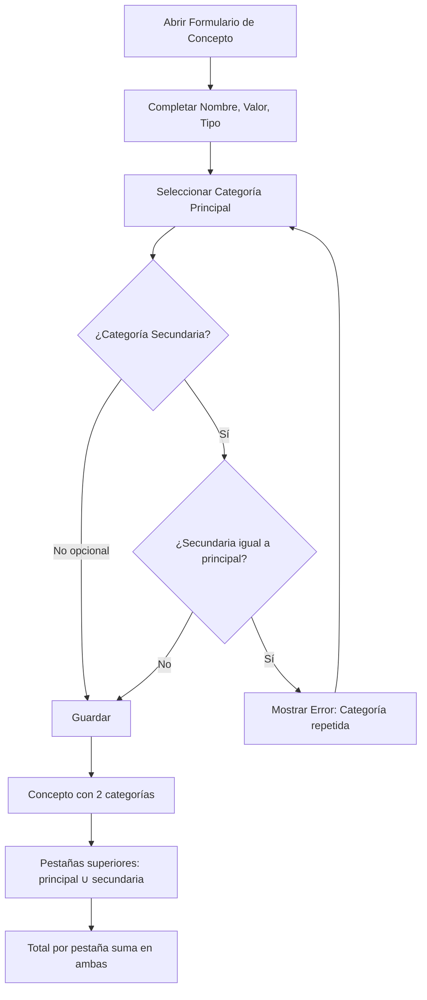

# Caso de Uso: Asignar Categoría Secundaria a Conceptos

## 👥 Perspectiva Funcional

### Objetivo
Permitir al usuario clasificar un concepto (de un proyecto o de un reporte) con una **categoría principal** y, de forma opcional, una **categoría secundaria**. El objetivo es poder agrupar y filtrar los conceptos tanto por su categoría principal como por la secundaria en las pestañas superiores de la matriz — un mismo concepto puede aparecer y sumar en ambas pestañas.

### Actores
- Usuario autenticado con acceso al módulo de Finanzas (conceptos de proyecto) o al módulo de Reportes (conceptos de reporte).

### Guía de Uso
1. El usuario ingresa a **Proyectos > Conceptos del Proyecto** o a **Reportes > Conceptos del Reporte**.
2. Hace clic en **Agregar Concepto** y se abre el formulario.
3. El formulario ahora muestra, además de la categoría obligatoria, un nuevo campo:
   - **Categoría secundaria (opcional)**: lista con la opción vacía activada ("Sin categoría secundaria..."). Se puede escribir para filtrar y se puede limpiar con la "x".
4. Si el usuario elige una categoría secundaria, el sistema la muestra como etiqueta y al guardar el concepto queda clasificado con **dos categorías**.
5. En la parte superior de la matriz hay un filtro **"Ver por"**:permite alternar la dimensión de agrupado entre **Categoría principal** y **Categoría secundaria** (extensible a una tercera categoría a futuro). Al elegir "Secundaria", las pestañas muestran solo las categorías usadas como secundaria y los conceptos/totales corresponden únicamente a ese rol; el valor de un concepto con dos categorías **se suma en ambas**.
6. Al crear un **Reporte** con conceptos, la categoría secundaria de cada concepto del proyecto se hereda automáticamente al concepto del reporte.

### Reglas de Oro
- La categoría secundaria es **opcional**: puede quedar vacía.
- La categoría secundaria **no puede ser igual** a la categoría principal (validada en UI y dominio).
- Si un concepto aparece en dos pestañas, su valor **se suma en ambas** (decisión de negocio).
- La edición del concepto permite modificar **nombre, valor, categoría principal y categoría secundaria**.
- La categoría secundaria puede pertenecer al mismo catálogo global de categorías.



## 💻 Perspectiva Técnica

### Mapa de Componentes

| Capa | Proyecto | Archivo | Responsabilidad |
| :--- | :--- | :--- | :--- |
| Presentación | `FinanKore.Web` | `Conceptos.razor` | Formulario de creación con dropdown "Categoría secundaria (opcional)" (`AllowClear`). |
| Presentación | `FinanKore.Web` | `ProyectoConceptos.razor` | Pestañas agrupadas por principal ∪ secundaria + dropdown secundario. |
| Presentación | `FinanKore.Web` | `ReporteConceptos.razor` | Pestañas y totales por categoría incluyendo secundaria + dropdown secundario. |
| Presentación | `FinanKore.Web` | `ReportesProyecto.razor` | Pestañas del listado de conceptos de reportes, agrupa por ambas categorías. |
| Presentación | `FinanKore.Web` | `ServicioFinanzas.cs` | DTO `ConceptoCreadoDto` con `CategoriaSecundariaId`; modelos `CrearConceptoModelo` / `CrearConceptoReporteModelo` con `CategoriaSecundariaId`. |
| WebApi | `FinanKore.WebApi` | `FinanzasEndpoints.cs` / `ReportesEndpoints.cs` | Bindean el JSON al comando (el `proyectoId`/`reporteId` llega en el body). |
| Aplicación | `FinanKore.Application` | `CrearConceptoComando.cs` / `CrearConceptoReporteComando.cs` | Incluyen `Guid? CategoriaSecundariaId`. |
| Aplicación | `FinanKore.Application` | `CrearConcepto(Reporte)Manejador.cs` | Propagan el campo al agregado y al DTO de salida. |
| Aplicación | `FinanKore.Application` | `ObtenerConceptosPorProyectoManejador.cs`, `ObtenerConceptosPorReporteManejador.cs`, `ObtenerReportesPorProyectoManejador.cs` | Proyectan `CategoriaSecundariaId` a los DTOs. |
| Aplicación | `FinanKore.Application` | `CrearReporteManejador.cs` | Hereda la categoría secundaria al crear el reporte. |
| Dominio | `FinanKore.Domain` | `Finanzas/Concepto.cs` | Propiedad `CategoriaSecundariaId`, método `ActualizarCategoriaSecundaria`, invariantes: no `Guid.Empty`, no igual a principal. |
| Dominio | `FinanKore.Domain` | `Proyecto/ConceptoReporte.cs` | Mismas invariantes para conceptos de reporte. |
| Dominio | `FinanKore.Domain` | `Finanzas/Proyecto.cs`, `Proyecto/Reporte.cs` | `CrearConcepto(nombre, valor, tipo, categoriaId, categoriaSecundariaId = null)`. |
| Dominio | `FinanKore.Domain` | `Eventos/ConceptoCreado.cs`, `Eventos/ConceptoReporteCreado.cs` | Los eventos de dominio viajan con la categoría secundaria. |
| Infraestructura | `FinanKore.Infrastructure` | `ConceptoConfiguracion.cs` / `ConceptoReporteConfiguracion.cs` | FK nullable a `Categorias` (`NoAction`) e índices `IX_*_CategoriaSecundariaId`. |
| Base de Datos | `docs/sql/FK_CategoriaSecundaria.sql` | `migrations.sql` | Columna + índices + FKs idempotentes (script `docs/sql/FK_CategoriaSecundaria.sql`). |

### Contrato de Datos

**Entrada - Crear Concepto (con secundaria):**
```csharp
public sealed record CrearConceptoComando(
    Guid ProyectoId,
    Guid CategoriaId,
    Guid? CategoriaSecundariaId,
    string Nombre,
    decimal Valor,
    TipoMovimiento Tipo);
```

**Salida:**
```csharp
public sealed record ConceptoDto(
    Guid Id, string Nombre, decimal Valor, TipoMovimiento Tipo,
    Guid ProyectoId, Guid CategoriaId, DateTimeOffset FechaCreacion,
    Guid? CategoriaSecundariaId = null);
```

> Nota: el endpoint `POST api/finanzas/proyectos/{proyectoId}/conceptos` toma `ProyectoId` desde el **body** (propiedad del comando), no de la ruta.

### Lógica de Dominio

Invariante en `Concepto` (idéntica en `ConceptoReporte`):
```csharp
public void ActualizarCategoriaSecundaria(Guid? categoriaSecundariaId)
{
    if (categoriaSecundariaId.HasValue && categoriaSecundariaId.Value == Guid.Empty)
        throw new ExcepcionDominio("La categoría secundaria no es válida.");

    if (categoriaSecundariaId.HasValue && categoriaSecundariaId.Value == CategoriaId)
        throw new ExcepcionDominio("La categoría secundaria no puede ser igual a la categoría principal.");

    CategoriaSecundariaId = categoriaSecundariaId;
}
```
La validación "no igual a principal" también se repite en `Concepto.Crear(...)` y en la capa Web antes de enviar la petición.

### Persistencia
- Tablas afectadas: `Finanzas.Conceptos` y `Proyecto.ConceptoReportes` — nueva columna `CategoriaSecundariaId uniqueidentifier NULL`, FKs `FK_DConceptos_CategoriasSecundaria` / `FK_DConceptoReportes_CategoriasSecundaria` hacia `Finanzas.Categorias`, índices `IX_*_CategoriaSecundariaId`.
- La restricción única sigue siendo por **categoría principal** (`UQ_Conceptos_ProyectoId_Nombre_CategoriaId`): dos conceptos con el mismo nombre y distinta secundaria **no** se consideran duplicados de forma distinta.

### Flujo de Secuencia

```mermaid
sequenceDiagram
    actor Usuario
    participant UI as ProyectoConceptos.razor
    participant SVC as ServicioFinanzas
    participant API as FinanzasEndpoints
    participant CMD as CrearConceptoManejador
    participant PROJ as Proyecto (Agregado)
    participant CON as Concepto (Entidad)
    participant DB as AppDbContext / SQL

    Usuario->>UI: Clic "Agregar Concepto"
    Usuario->>UI: Completa nombre, valor, tipo, categoría y (opcional) secundaria
    UI->>UI: Valida: secundaria != principal; limpia Guid.Empty -> null
    UI->>SVC: CrearConceptoAsync(modelo)
    SVC->>API: POST api/finanzas/proyectos/{id}/conceptos
    API->>CMD: Send(CrearConceptoComando)
    CMD->>PROJ: ObtenerPorIdConConceptos + CrearConcepto(...)
    PROJ->>CON: Concepto.Crear(... CategoriaSecundariaId)
    CON-->>PROJ: Entidad creada (+ ConceptoCreado)
    PROJ-->>CMD: Concepto
    CMD->>DB: GuardarCambiosAsync (INSERT + publicar eventos)
    DB-->>CMD: Ok
    CMD-->>API: ConceptoDto (con CategoriaSecundariaId)
    API-->>UI: 201 Created
    UI-->>Usuario: Pestañas recalculadas (principal ∪ secundaria)
```

---

## Edición de categorías

En el modal "Editar Concepto" (conceptos de proyecto y de reporte) ahora se pueden modificar:
- **Categoría principal** (obligatoria, obliga a cambiar si existe otro concepto con mismo nombre+cat tipo en el scope).
- **Categoría secundaria** (opcional, con `AllowClear`).

Reglas reflejadas en:
- Dominio: `Proyecto.ActualizarConcepto(...)` / `Reporte.ActualizarConceptoReporte(...)` validan duplicados por nombre+categoria+tipo y delegan en `Concepto(Reporte).ActualizarCategoria` / `ActualizarCategoriaSecundaria`.
- Aplicación: `ActualizarConceptoComando(Reporte)Comando` con `CategoriaId` y `CategoriaSecundariaId`; los manejadores cargan el agregado (`Proyecto`/`Reporte` con conceptos) y aplican los cambios.
- Web: `ServicioFinanzas.EditarConceptoAsync/EditarConceptoProyectoAsync` envían `categoriaId` y `categoriaSecundariaId` en el PUT; los dropdowns del modal permiten `AllowClear` en la secundaria y validan repetición antes de enviar.

```mermaid
sequenceDiagram
    actor Usuario
    participant UI as Modal "Editar Concepto"
    participant API as Endpoints PUT
    participant APP as Manejador (MediatR)
    participant AGG as Agregado (Proyecto/Reporte)
    participant DB as SQL Server

    Usuario->>UI: Editar categorías y guardar
    UI->>UI: Valida secundaria != principal; normaliza vacío -> null
    UI->>API: PUT {nombre, valor, categoriaId, categoriaSecundariaId}
    API->>APP: ActualizarConcepto(Reporte)Comando
    APP->>AGG: Actualizar... (valida duplicados)
    APP->>DB: GuardarCambiosAsync (UPDATE)
    DB-->>APP: OK
    APP-->>UI: DTO con categorías nuevas
```

- Se amplió el modelo de dominio con `CategoriaSecundariaId` (opcional) en `Concepto` y `ConceptoReporte`.
- Se propagó el campo por Aplicación (comandos, manejadores, consultas, DTOs) y Web (modelos, DTO `ConceptoCreadoDto`, formularios y pestañas).
- Se agregaron columnas, índices y FKs idempotentes en `migrations.sql` y el script directo `docs/sql/FK_CategoriaSecundaria.sql` ya aplicado a la BD.
- El despacho de eventos de dominio (`ConceptoCreado`, etc.) ahora ocurre en `AppDbContext` tras `SaveChanges` vía `EnvoltorioEventoDominio<T>` (MediatR), por lo que los eventos al guardar un concepto llegan con el nuevo campo.
- La extracción de la RCL `FinanKore.SharedUI` no afecta este caso de uso (componentes de presentación generales).
