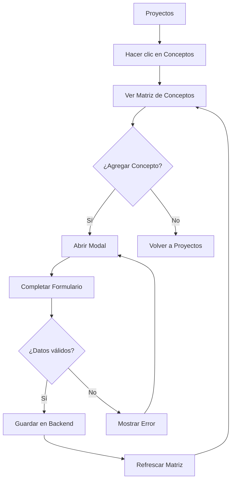
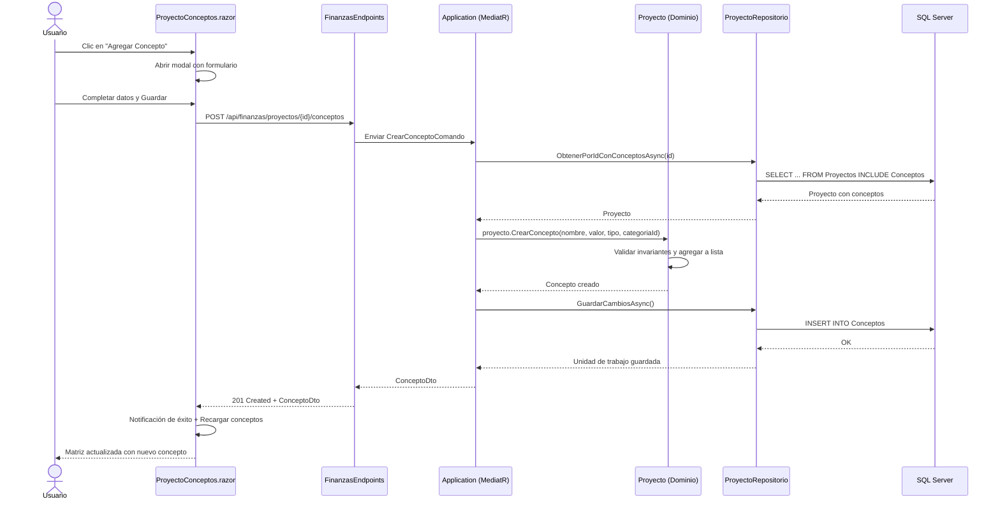

# Caso de Uso: Crear Concepto Proyecto

## 👥 Perspectiva Funcional

### Objetivo
Permitir al usuario visualizar y gestionar los conceptos financieros (entradas y salidas) de un proyecto específico, organizados en una matriz dinámica por categorías. Solo se muestran las categorías que efectivamente contienen conceptos asignados.

### Actores
- Usuario autenticado con acceso al módulo de Finanzas.

### Guía de Uso
1. El usuario ingresa al módulo **Proyectos** (`/finanzas/proyectos`).
2. En la lista de proyectos, hace clic en el botón **Conceptos** del proyecto deseado.
3. El sistema muestra la matriz de conceptos por categoría:
   - **Filas**: Cada concepto registrado en el proyecto.
   - **Columnas**: Solo las categorías que tienen al menos un concepto asignado.
   - **Celdas**: Valor del concepto. Si es entrada, aparece en verde (`$ 1.700`). Si es salida, aparece en rojo entre paréntesis (`$ (500)`).
4. Para agregar un nuevo concepto, el usuario hace clic en **Agregar Concepto**.
5. Se abre una ventana modal con el formulario:
   - **Nombre**: Nombre descriptivo del concepto.
   - **Valor**: Monto en dólares (solo positivos).
   - **Tipo de Movimiento**: Entrada o Salida.
   - **Categoría**: Categoría global del sistema a la que pertenece.
6. Al guardar, el sistema valida los campos y refresca automáticamente la matriz, mostrando la nueva columna de categoría si es la primera vez que se usa.

### Reglas de Negocio
- Un concepto no puede tener nombre vacío ni exceder los 200 caracteres.
- El valor debe ser mayor a cero. El tipo de movimiento (Entrada/Salida) determina el signo visual en la matriz.
- No pueden existir dos conceptos con el mismo nombre dentro del mismo proyecto.
- La categoría es obligatoria y debe existir en el catálogo global de categorías.
- La matriz solo pinta las columnas de categorías que tienen al menos un concepto asociado en el proyecto.



## 💻 Perspectiva Técnica

### Mapa de Componentes

| Capa | Proyecto | Archivo | Responsabilidad |
| :--- | :--- | :--- | :--- |
| Presentación | `FinanKore.Web` | `Proyectos.razor` | Lista de proyectos con botón de navegación a Conceptos. |
| Presentación | `FinanKore.Web` | `ProyectoConceptos.razor` | Página de matriz dinámica, modal de creación y refresco de datos. |
| Presentación | `FinanKore.Web` | `ServicioFinanzas.cs` | Cliente HTTP para consumir API de conceptos y categorías. |
| WebApi | `FinanKore.WebApi` | `FinanzasEndpoints.cs` | Endpoints `GET/POST` para conceptos por proyecto (`api/finanzas/proyectos/{proyectoId}/conceptos`). |
| Aplicación | `FinanKore.Application` | `ObtenerConceptosPorProyectoConsulta.cs` | Consulta MediatR para listar conceptos de un proyecto. |
| Aplicación | `FinanKore.Application` | `ObtenerConceptosPorProyectoManejador.cs` | Handler que consulta el repositorio y proyecta a DTOs. |
| Aplicación | `FinanKore.Application` | `CrearConceptoComando.cs` | Comando MediatR para crear un concepto. |
| Aplicación | `FinanKore.Application` | `CrearConceptoManejador.cs` | Handler que carga el agregado Proyecto, invoca `CrearConcepto` y persiste. |
| Dominio | `FinanKore.Domain` | `Proyecto.cs` | Agregado raíz. Contiene la colección de conceptos y el método `CrearConcepto()`. |
| Dominio | `FinanKore.Domain` | `Concepto.cs` | Entidad hijo con reglas de invariantes (nombre único, valor positivo, etc.). |
| Dominio | `FinanKore.Domain` | `IProyectoRepositorio.cs` | Interfaz del repositorio con `ObtenerPorIdConConceptosAsync`. |
| Infraestructura | `FinanKore.Infrastructure` | `ProyectoRepositorio.cs` | Implementación EF Core con `Include(p => p.Conceptos)`. |
| Infraestructura | `FinanKore.Infrastructure` | `ConceptoConfiguracion.cs` | Configuración EF Core de la tabla `Finanzas.Conceptos`. |

### Contrato de Datos

**Entrada - Crear Concepto:**
```csharp
public sealed record CrearConceptoComando(
    Guid ProyectoId,
    Guid CategoriaId,
    string Nombre,
    decimal Valor,
    TipoMovimiento Tipo);
```

**Salida - Concepto Creado:**
```csharp
public sealed record ConceptoDto(
    Guid Id,
    string Nombre,
    decimal Valor,
    TipoMovimiento Tipo,
    Guid ProyectoId,
    Guid CategoriaId,
    DateTimeOffset FechaCreacion);
```

### Lógica de Dominio
La lógica de creación de conceptos reside en el **Agregado Raíz `Proyecto`**:
```csharp
public Concepto CrearConcepto(string nombre, decimal valor, TipoMovimiento tipo, Guid categoriaId)
{
    if (_conceptos.Any(c => c.Nombre.Equals(nombre, StringComparison.OrdinalIgnoreCase)))
        throw new ExcepcionDominio("Ya existe un concepto con el mismo nombre en este proyecto.");

    var concepto = Concepto.Crear(nombre, valor, tipo, Id, categoriaId);
    _conceptos.Add(concepto);
    return concepto;
}
```

La entidad `Concepto` también contiene invariantes:
- Nombre obligatorio y máximo 200 caracteres.
- Valor no negativo.
- Tipo de movimiento válido (enum).
- ProyectoId y CategoriaId no vacíos.

### Flujo de Secuencia



### Persistencia
- **Tabla**: `Finanzas.Conceptos`
- **Columnas**: `Id` (PK), `Nombre`, `Valor` (decimal(18,2)), `Tipo` (int), `ProyectoId` (FK), `CategoriaId` (FK), `FechaCreacion`
- **Índices**: `IX_Conceptos_ProyectoId`, `IX_Conceptos_CategoriaId`, `UQ_Conceptos_ProyectoId_Nombre`
