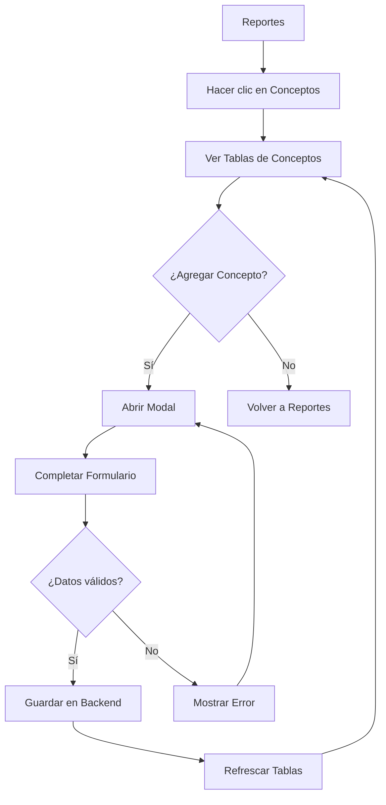
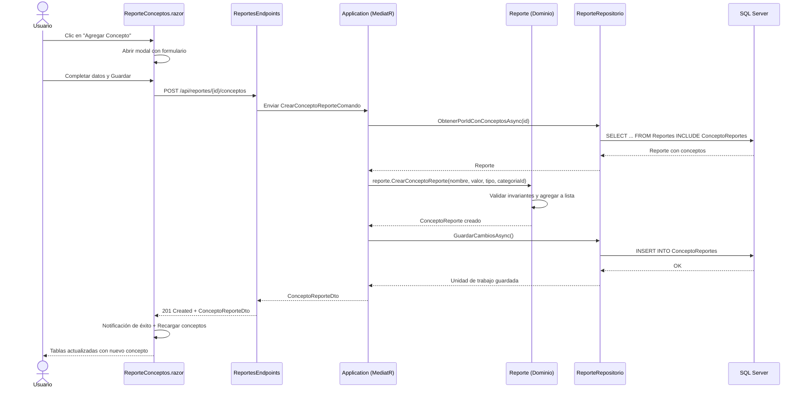

# Caso de Uso: Crear Concepto Reporte

## 👥 Perspectiva Funcional

### Objetivo
Permitir al usuario visualizar y gestionar los conceptos financieros (entradas y salidas) de un reporte específico, organizados en una matriz dinámica por categorías. El sistema presenta dos vistas simultáneas: una tabla resumen con totales por categoría y saldo general, y una tabla de detalle con cada concepto desagregado por categoría.

### Actores
- Usuario autenticado con acceso al módulo de Reportes.

### Guía de Uso
1. El usuario ingresa al módulo **Reportes** (`/finanzas/reportes`).
2. En la lista de reportes, hace clic en el botón **Conceptos** del reporte deseado.
3. El sistema navega a la página de conceptos del reporte y muestra dos tablas:
   - **Tabla izquierda (Totales)**: Lista cada categoría usada con su total acumulado (entradas menos salidas) y el saldo general al final.
   - **Tabla derecha (Detalle)**: Muestra cada concepto como fila y cada categoría como columna. El valor aparece en la intersección correspondiente.
   - Los valores de entrada se muestran en verde (`$ 1.700`). Los valores de salida aparecen en rojo entre paréntesis (`$ (500)`).
4. Para agregar un nuevo concepto, el usuario hace clic en **Agregar Concepto**.
5. Se abre una ventana modal con el formulario:
    - **Nombre**: Nombre descriptivo del concepto.
    - **Valor**: Monto en dólares (solo positivos).
    - **Tipo de Movimiento**: Entrada o Salida.
    - **Categoría**: Categoría global del sistema a la que pertenece.
6. Al guardar, el sistema valida los campos, persiste el concepto y refresca ambas tablas automáticamente.

### Reglas de Negocio
- Un concepto no puede tener nombre vacío ni exceder los 200 caracteres.
- El valor debe ser mayor a cero. El tipo de movimiento (Entrada/Salida) determina el signo visual en la matriz.
- No pueden existir dos conceptos con el mismo nombre dentro del mismo reporte.
- La categoría es obligatoria y debe existir en el catálogo global de categorías.
- Solo se muestran en las tablas las categorías que tienen al menos un concepto asociado en el reporte.
- El saldo general se calcula como la suma de todas las entradas menos la suma de todas las salidas.



## 💻 Perspectiva Técnica

### Mapa de Componentes

| Capa | Proyecto | Archivo | Responsabilidad |
| :--- | :--- | :--- | :--- |
| Presentación | `FinanKore.Web` | `Reportes.razor` | Lista de reportes con botón de navegación a Conceptos. |
| Presentación | `FinanKore.Web` | `ReporteConceptos.razor` | Página con dos tablas (totales y detalle), modal de creación y refresco de datos. |
| Presentación | `FinanKore.Web` | `ServicioFinanzas.cs` | Cliente HTTP para consumir API de conceptos de reporte y categorías. |
| WebApi | `FinanKore.WebApi` | `ReportesEndpoints.cs` | Endpoints `GET/POST` para conceptos por reporte (`api/reportes/{reporteId}/conceptos`). |
| Aplicación | `FinanKore.Application` | `ObtenerConceptosPorReporteConsulta.cs` | Consulta MediatR para listar conceptos de un reporte. |
| Aplicación | `FinanKore.Application` | `ObtenerConceptosPorReporteManejador.cs` | Handler que consulta el repositorio y proyecta a DTOs. |
| Aplicación | `FinanKore.Application` | `CrearConceptoReporteComando.cs` | Comando MediatR para crear un concepto de reporte. |
| Aplicación | `FinanKore.Application` | `CrearConceptoReporteManejador.cs` | Handler que carga el agregado Reporte, invoca `CrearConceptoReporte` y persiste. |
| Dominio | `FinanKore.Domain` | `Reporte.cs` | Agregado raíz. Contiene la colección de conceptos y el método `CrearConceptoReporte()`. |
| Dominio | `FinanKore.Domain` | `ConceptoReporte.cs` | Entidad hijo con reglas de invariantes (nombre único, valor positivo, etc.). |
| Dominio | `FinanKore.Domain` | `IReporteRepositorio.cs` | Interfaz del repositorio con `ObtenerPorIdConConceptosAsync`. |
| Infraestructura | `FinanKore.Infrastructure` | `ReporteRepositorio.cs` | Implementación EF Core con `Include(r => r.Conceptos)`. |
| Infraestructura | `FinanKore.Infrastructure` | `ConceptoReporteConfiguracion.cs` | Configuración EF Core de la tabla `Proyecto.ConceptoReportes`. |

### Contrato de Datos

**Entrada - Crear Concepto Reporte:**
```csharp
public sealed record CrearConceptoReporteComando(
    Guid ReporteId,
    Guid CategoriaId,
    string Nombre,
    decimal Valor,
    TipoMovimiento Tipo);
```

**Salida - Concepto Reporte Creado:**
```csharp
public sealed record ConceptoReporteDto(
    Guid Id,
    string Nombre,
    decimal Valor,
    TipoMovimiento Tipo,
    Guid ReporteId,
    Guid CategoriaId,
    DateTimeOffset FechaCreacion);
```

### Lógica de Dominio
La lógica de creación de conceptos reside en el **Agregado Raíz `Reporte`**:
```csharp
public ConceptoReporte CrearConceptoReporte(string nombre, decimal valor, TipoMovimiento tipo, Guid categoriaId)
{
    if (_conceptos.Any(c => c.Nombre.Equals(nombre, StringComparison.OrdinalIgnoreCase)))
        throw new ExcepcionDominio("Ya existe un concepto con el mismo nombre en este reporte.");

    var concepto = ConceptoReporte.Crear(nombre, valor, tipo, Id, categoriaId);
    _conceptos.Add(concepto);
    return concepto;
}
```

La entidad `ConceptoReporte` también contiene invariantes:
- Nombre obligatorio y máximo 200 caracteres.
- Valor no negativo.
- Tipo de movimiento válido (enum).
- ReporteId y CategoriaId no vacíos.

### Flujo de Secuencia



### Persistencia
- **Tabla**: `Proyecto.ConceptoReportes`
- **Columnas**: `Id` (PK), `Nombre`, `Valor` (decimal(18,2)), `Tipo` (int), `ReporteId` (FK), `CategoriaId` (FK), `FechaCreacion`
- **Índices**: `IX_ConceptoReportes_ReporteId`, `IX_ConceptoReportes_CategoriaId`, `UQ_ConceptoReportes_ReporteId_Nombre`
