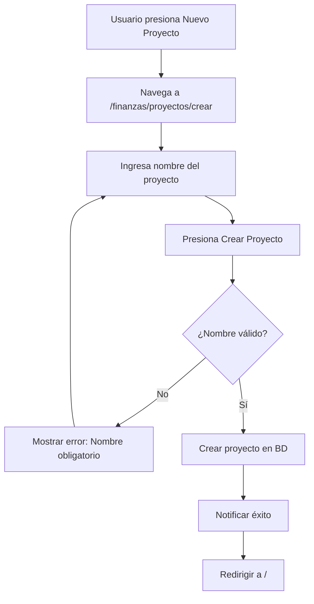
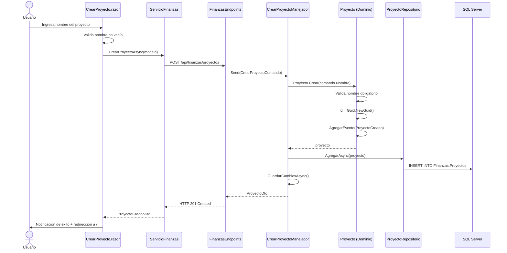

# Caso de Uso: Crear Proyecto

## 👥 Perspectiva Funcional

### Objetivo
Permitir que un usuario registrado cree un nuevo proyecto financiero en FinanKore para organizar proyecciones, simulaciones, ahorros, deudas o gastos.

### Actor
- **Usuario registrado**: cualquier persona que haya iniciado sesión en el sistema.

### Guía de Uso
1. El usuario accede a la página de inicio y presiona el botón **Nuevo Proyecto** en la barra de navegación.
2. El sistema muestra el formulario de creación en `/finanzas/proyectos/crear`.
3. El usuario completa el campo obligatorio:
   - **Nombre del proyecto**: nombre descriptivo del proyecto financiero.
4. El usuario presiona **Crear Proyecto**.
5. El sistema valida los datos:
   - Si el nombre está vacío, muestra: *"El nombre del proyecto no puede estar vacío."*
   - Si los datos son válidos, crea el proyecto y redirige al inicio.
6. El usuario recibe una notificación de éxito: *"Proyecto '[Nombre]' creado"*.
7. En la página de inicio, el sistema muestra el proyecto creado.

### Reglas de Negocio
- El **nombre del proyecto es obligatorio**.
- El nombre debe tener al menos un carácter (sin espacios en blanco).
- Se asigna un `Id` único (`Guid`) automáticamente al crear el proyecto.
- Se emite el evento de dominio **ProyectoCreado** al crear exitosamente.

### Diagrama de Flujo Funcional



---

## 💻 Perspectiva Técnica

### Mapa de Componentes

| Capa | Proyecto | Archivo | Responsabilidad |
| :--- | :--- | :--- | :--- |
| **Presentación** | `FinanKore.Web` | `Components/Pages/CrearProyecto.razor` | Formulario Radzen con validación frontal |
| **Presentación** | `FinanKore.Web` | `Servicios/ServicioFinanzas.cs` | Cliente HTTP que envía petición a WebApi |
| **Presentación** | `FinanKore.Web` | `Models/CrearProyectoModelo.cs` | Modelo de datos del formulario |
| **API** | `FinanKore.WebApi` | `Endpoints/FinanzasEndpoints.cs` | Minimal API que expone `POST /api/finanzas/proyectos` |
| **Aplicación** | `FinanKore.Application` | `Finanzas/Comandos/CrearProyectoComando.cs` | Record MediatR con datos de entrada |
| **Aplicación** | `FinanKore.Application` | `Finanzas/Comandos/CrearProyectoManejador.cs` | Handler que orquesta el flujo de creación |
| **Aplicación** | `FinanKore.Application` | `Finanzas/Dtos/ProyectoDto.cs` | DTO de respuesta con Id y Nombre |
| **Aplicación** | `FinanKore.Application` | `Comun/Interfaces/IUnidadDeTrabajo.cs` | Interfaz de persistencia transaccional |
| **Dominio** | `FinanKore.Domain` | `Finanzas/Proyecto.cs` | Entidad raíz agregada. Método `Crear(nombre)` |
| **Dominio** | `FinanKore.Domain` | `Finanzas/Eventos/ProyectoCreado.cs` | Evento de dominio emitido al crear proyecto |
| **Dominio** | `FinanKore.Domain` | `Finanzas/IProyectoRepositorio.cs` | Interfaz del repositorio |
| **Infraestructura** | `FinanKore.Infrastructure` | `Persistencia/Repositorios/ProyectoRepositorio.cs` | Implementación EF Core |
| **Infraestructura** | `FinanKore.Infrastructure` | `Persistencia/Configuraciones/ProyectoConfiguracion.cs` | Mapeo de entidad a tabla `Finanzas.Proyectos` |
| **Infraestructura** | `FinanKore.Infrastructure` | `Persistencia/AppDbContext.cs` | DbContext con Unidad de Trabajo |

### Contrato de Datos

**Entrada:** `CrearProyectoComando`
```csharp
public sealed record CrearProyectoComando(
    string Nombre   // NVARCHAR(200), obligatorio
) : IRequest<ProyectoDto>;
```

**Salida:** `ProyectoDto`
```csharp
public sealed record ProyectoDto(
    Guid Id,
    string Nombre
);
```

### Lógica de Dominio

La lógica de negocio reside en la **Entidad `Proyecto`** (`src/FinanKore.Domain/Finanzas/Proyecto.cs`), método `Crear`:

```csharp
public static Proyecto Crear(string nombre)
{
    if (string.IsNullOrWhiteSpace(nombre))
        throw new ExcepcionDominio("El nombre del proyecto es obligatorio.");

    return new Proyecto(nombre);
}
```

**Invariantes validadas:**
1. El nombre del proyecto no puede estar vacío.

**Evento emitido:** `ProyectoCreado(ProyectoId, Nombre)` con `FechaOcurrencia = DateTimeOffset.UtcNow`.

### Persistencia

**Tabla:** `Finanzas.Proyectos`

| Columna | Tipo | Restricción |
| :--- | :--- | :--- |
| `Id` | `UNIQUEIDENTIFIER` | `PK` |
| `Nombre` | `NVARCHAR(200)` | `NOT NULL` |

**Índices:**
- `IX_Proyectos_Nombre`: índice no agrupado sobre `Nombre` para búsquedas.

### Diagrama de Secuencia


