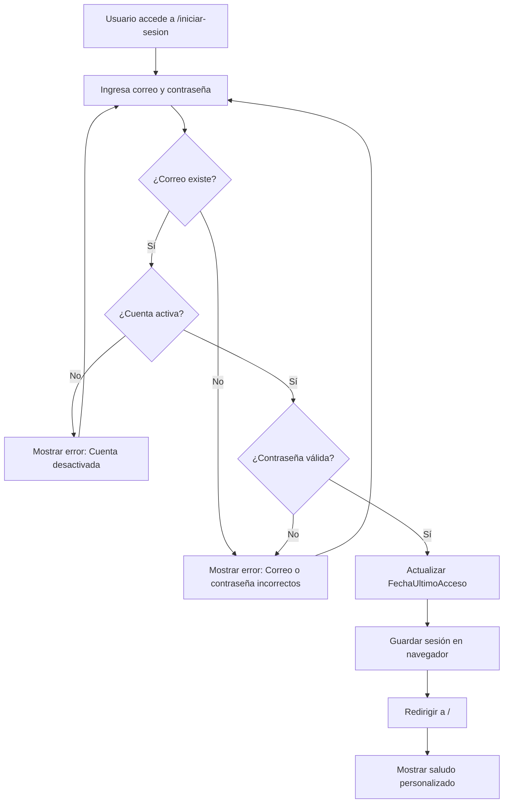
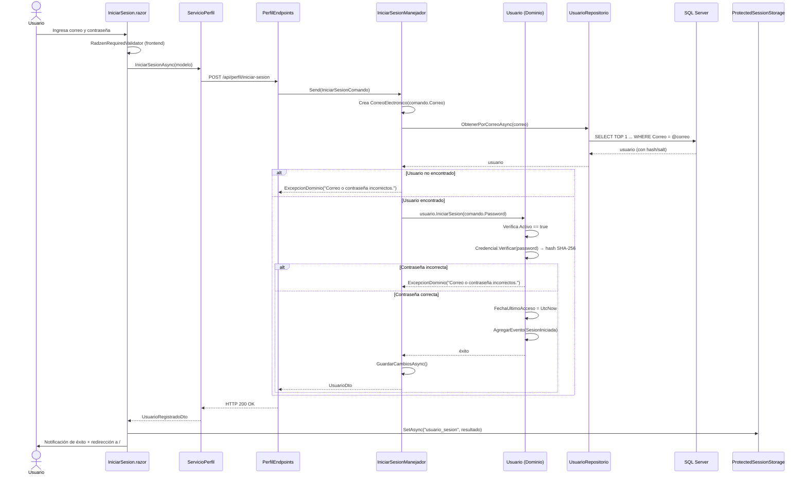

# Caso de Uso: Iniciar Sesión

## 👥 Perspectiva Funcional

### Objetivo
Permitir que un usuario registrado acceda a su cuenta en FinanKore mediante su correo electrónico y contraseña.

### Actor
- **Usuario registrado**: cualquier persona que ya posea una cuenta activa en el sistema.

### Guía de Uso
1. El usuario accede a la página de inicio (`/`) y presiona el botón **Iniciar Sesión**.
2. El sistema muestra el formulario de inicio de sesión en `/iniciar-sesion`.
3. El usuario completa los campos obligatorios:
   - **Correo electrónico**: dirección registrada previamente.
   - **Contraseña**: clave asociada a la cuenta.
4. El usuario presiona **Iniciar Sesión**.
5. El sistema valida los datos:
   - Si el correo no existe o la contraseña es incorrecta, muestra: *"Correo o contraseña incorrectos."*
   - Si la cuenta está desactivada, muestra: *"Tu cuenta está desactivada. Contacta a soporte."*
   - Si los datos son válidos, inicia la sesión y redirige al inicio.
6. El usuario recibe una notificación de éxito: *"¡Bienvenido [Nombre]! Has iniciado sesión exitosamente."*
7. En la página de inicio, el sistema muestra el nombre del usuario y la opción de **Cerrar Sesión**.

### Reglas de Negocio
- El **correo y la contraseña son obligatorios**.
- La **cuenta debe estar activa** (`Activo = true`) para poder iniciar sesión.
- La contraseña ingresada se compara con el hash almacenado (SHA-256 + salt).
- Al iniciar sesión exitosamente, se actualiza la **fecha del último acceso**.
- Se emite el evento de dominio **SesionIniciada**.
- La sesión del usuario se persiste en el navegador mediante `ProtectedSessionStorage`.

### Diagrama de Flujo Funcional



---

## 💻 Perspectiva Técnica

### Mapa de Componentes

| Capa | Proyecto | Archivo | Responsabilidad |
| :--- | :--- | :--- | :--- |
| **Presentación** | `FinanKore.Web` | `Components/Pages/IniciarSesion.razor` | Formulario Radzen con `RadzenTemplateForm` y validadores |
| **Presentación** | `FinanKore.Web` | `Components/Pages/Home.razor` | Verifica sesión en `ProtectedSessionStorage` y muestra estado |
| **Presentación** | `FinanKore.Web` | `Servicios/ServicioPerfil.cs` | Cliente HTTP que envía petición a WebApi |
| **Presentación** | `FinanKore.Web` | `Models/IniciarSesionModelo.cs` | Modelo de datos del formulario |
| **API** | `FinanKore.WebApi` | `Endpoints/PerfilEndpoints.cs` | Minimal API que expone `POST /api/perfil/iniciar-sesion` |
| **Aplicación** | `FinanKore.Application` | `Perfil/Comandos/IniciarSesionComando.cs` | Record MediatR con datos de entrada |
| **Aplicación** | `FinanKore.Application` | `Perfil/Comandos/IniciarSesionManejador.cs` | Handler que orquesta el flujo de autenticación |
| **Aplicación** | `FinanKore.Application` | `Perfil/Dtos/UsuarioDto.cs` | DTO de respuesta con datos del usuario autenticado |
| **Aplicación** | `FinanKore.Application` | `Comun/Interfaces/IUnidadDeTrabajo.cs` | Interfaz de persistencia transaccional |
| **Dominio** | `FinanKore.Domain` | `Perfil/Usuario.cs` | Entidad raíz agregada. Método `IniciarSesion(passwordPlano)` |
| **Dominio** | `FinanKore.Domain` | `Perfil/ObjetosValor/CorreoElectronico.cs` | Valida formato del correo |
| **Dominio** | `FinanKore.Domain` | `Perfil/ObjetosValor/Credencial.cs` | Verifica hash SHA-256 + salt |
| **Dominio** | `FinanKore.Domain` | `Perfil/Eventos/SesionIniciada.cs` | Evento de dominio emitido al autenticar |
| **Dominio** | `FinanKore.Domain` | `Perfil/IUsuarioRepositorio.cs` | Interfaz con `ObtenerPorCorreoAsync` |
| **Infraestructura** | `FinanKore.Infrastructure` | `Persistencia/Repositorios/UsuarioRepositorio.cs` | Implementación EF Core con índice cubierto |
| **Infraestructura** | `FinanKore.Infrastructure` | `Persistencia/Configuraciones/UsuarioConfiguracion.cs` | Mapeo de entidad a tabla `Perfil.Usuarios` |
| **Infraestructura** | `FinanKore.Infrastructure` | `Persistencia/AppDbContext.cs` | DbContext con Unidad de Trabajo |

### Contrato de Datos

**Entrada:** `IniciarSesionComando`
```csharp
public sealed record IniciarSesionComando(
    string Correo,   // NVARCHAR(200), obligatorio
    string Password  // Mínimo 6 caracteres en Dominio
) : IRequest<UsuarioDto>;
```

**Salida:** `UsuarioDto`
```csharp
public sealed record UsuarioDto(
    Guid Id,
    string Correo,
    string NombreCompleto,
    string? ImagenUrl,
    DateTimeOffset FechaRegistro
);
```

### Lógica de Dominio

La lógica de negocio principal reside en la **Entidad `Usuario`** (`src/FinanKore.Domain/Perfil/Usuario.cs`), método `IniciarSesion`:

```csharp
public void IniciarSesion(string passwordPlano)
{
    if (string.IsNullOrWhiteSpace(passwordPlano))
        throw new ExcepcionDominio("La contraseña es obligatoria.");

    if (!Activo)
        throw new ExcepcionDominio("Tu cuenta está desactivada. Contacta a soporte.");

    var exito = Credencial.Verificar(passwordPlano);

    if (!exito)
        throw new ExcepcionDominio("Correo o contraseña incorrectos.");

    FechaUltimoAcceso = DateTimeOffset.UtcNow;
    AgregarEvento(new SesionIniciada(Id, Correo, FechaUltimoAcceso.Value));
}
```

**Invariantes validadas:**
1. La contraseña no puede estar vacía.
2. La cuenta debe estar activa.
3. La contraseña debe coincidir con el hash almacenado (`Credencial.Verificar`).

**Objetos de valor involucrados:**
- `CorreoElectronico`: se usa para buscar al usuario en el repositorio.
- `Credencial`: contiene `Hash` y `Salt`. El método `Verificar` recalcula el hash con el salt almacenado.

**Evento emitido:** `SesionIniciada(UsuarioId, CorreoElectronico, FechaInicio)`.

### Persistencia

**Tabla:** `Perfil.Usuarios`

| Columna | Tipo | Restricción |
| :--- | :--- | :--- |
| `Id` | `UNIQUEIDENTIFIER` | `PK` |
| `Correo` | `NVARCHAR(200)` | `NOT NULL, UNIQUE` |
| `PasswordHash` | `NVARCHAR(100)` | `NOT NULL` |
| `PasswordSalt` | `NVARCHAR(50)` | `NOT NULL` |
| `Activo` | `BIT` | `NOT NULL, DEFAULT 1` |
| `FechaUltimoAcceso` | `DATETIMEOFFSET` | `NULL` |

**Índices optimizados para autenticación:**
- `IX_Usuarios_Autenticacion`: índice cubierto sobre `(Correo, Activo)` que incluye `PasswordHash`, `PasswordSalt` y demás columnas del DTO. Permite autenticar en una sola lectura.
- `IX_Usuarios_Activo`: índice filtrado `WHERE Activo = 1` para omitir cuentas desactivadas.

### Diagrama de Secuencia


