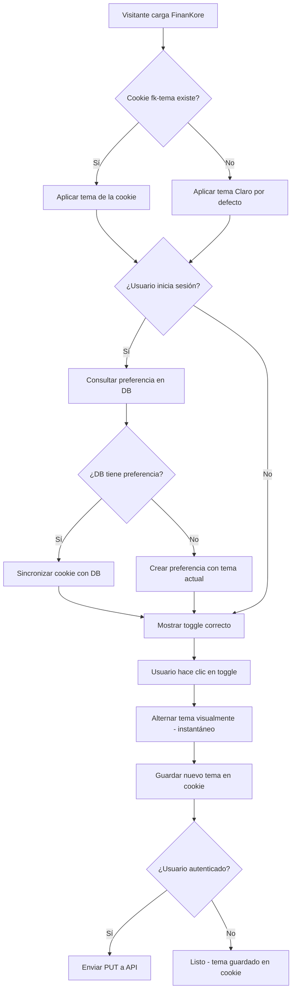
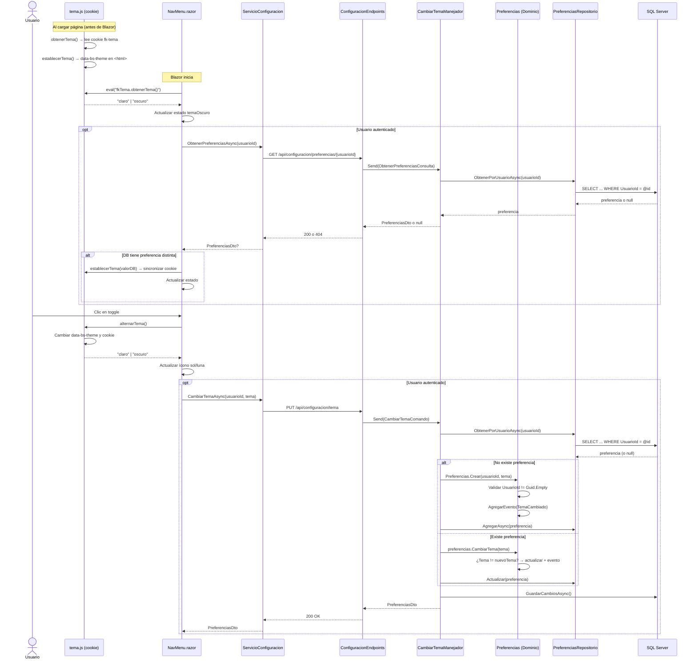

# Caso de Uso: Modo Oscuro / Claro

## 👥 Perspectiva Funcional

### Objetivo
Permitir al usuario alternar entre el modo claro y el modo oscuro de la interfaz. La preferencia se guarda automáticamente y se restaura al volver a visitar FinanKore, sin necesidad de iniciar sesión.

### Actores
- **Usuario anónimo**: cualquier visitante, incluso sin cuenta, puede cambiar el tema. La preferencia se guarda en una cookie del navegador.
- **Usuario autenticado**: al iniciar sesión, el sistema sincroniza su preferencia guardada en la base de datos. Si cambia de dispositivo, conserva el mismo tema.

### Guía de Uso

#### Cambiar el tema (estando en cualquier página)
1. El usuario observa el botón de tema en la parte inferior del sidebar izquierdo, con un ícono de **sol** ☀️ (modo oscuro) o **luna** 🌙 (modo claro) y el texto correspondiente.
2. El usuario hace clic en el botón.
3. El sistema cambia instantáneamente el tema visual — todos los colores, fondos y textos se adaptan.
4. La preferencia queda guardada y se mantendrá en futuras visitas.

#### Restauración automática del tema
- **Al cargar la página por primera vez:** el sistema lee la cookie `fk-tema` del navegador y aplica el tema antes de que se pinte ningún elemento, evitando parpadeos.
- **Al iniciar sesión:** el sistema consulta la preferencia guardada en la base de datos y la sincroniza con la cookie. Si el usuario cambió el tema en otro dispositivo, se aplica automáticamente.
- **Al cerrar sesión:** el tema actual se mantiene (no vuelve al modo claro por defecto).

### Reglas de Negocio
- El tema por defecto para nuevos visitantes es **Claro**.
- Solo se permiten dos valores: **Claro** y **Oscuro**.
- Cada usuario autenticado tiene **una única preferencia** (restricción única en `UsuarioId`).
- Si la API no está disponible al cambiar el tema, el sistema usa la cookie como respaldo.
- El cambio de tema es inmediato en el navegador (no requiere recargar la página).
- La cookie tiene una duración de **1 año** (`max-age=31536000`).

### Diagrama de Flujo Funcional



---

## 💻 Perspectiva Técnica

### Mapa de Componentes

| Capa | Proyecto | Archivo | Responsabilidad |
| :--- | :--- | :--- | :--- |
| **Presentación** | `FinanKore.Web` | `wwwroot/js/tema.js` | JS interop para cookie `fk-tema`. Lee/escribe/alterna sin flickering. |
| **Presentación** | `FinanKore.Web` | `Components/App.razor` | Carga `tema.js` en `<head>` antes del renderizado de Blazor. |
| **Presentación** | `FinanKore.Web` | `Components/Layout/NavMenu.razor` | Botón toggle sol/luna + lógica de sincronización cookie ↔ API. |
| **Presentación** | `FinanKore.Web` | `Components/Layout/NavMenu.razor.css` | Estilos del botón toggle + dark mode del sidebar. |
| **Presentación** | `FinanKore.Web` | `Components/Layout/MainLayout.razor.css` | Dark mode del layout header. |
| **Presentación** | `FinanKore.Web` | `wwwroot/app.css` | Variables CSS dark + overrides de tarjetas, tablas, KPI y charts. |
| **Presentación** | `FinanKore.Web` | `Servicios/ServicioConfiguracion.cs` | Cliente HTTP: `ObtenerPreferenciasAsync`, `CambiarTemaAsync`. |
| **API** | `FinanKore.WebApi` | `Endpoints/ConfiguracionEndpoints.cs` | Minimal API: `GET /api/configuracion/preferencias/{usuarioId}`, `PUT /api/configuracion/tema`. |
| **Aplicación** | `FinanKore.Application` | `Configuracion/Comandos/CambiarTemaComando.cs` | Record MediatR: `(Guid UsuarioId, string Tema)`. |
| **Aplicación** | `FinanKore.Application` | `Configuracion/Comandos/CambiarTemaManejador.cs` | Handler: crea o actualiza preferencia (upsert). |
| **Aplicación** | `FinanKore.Application` | `Configuracion/Consultas/ObtenerPreferenciasConsulta.cs` | Query: `(Guid UsuarioId)`. |
| **Aplicación** | `FinanKore.Application` | `Configuracion/Consultas/ObtenerPreferenciasManejador.cs` | Handler: retorna `PreferenciasDto` o `null`. |
| **Aplicación** | `FinanKore.Application` | `Configuracion/Dtos/PreferenciasDto.cs` | DTO: `(Id, UsuarioId, Tema)`. |
| **Dominio** | `FinanKore.Domain` | `Configuracion/Preferencias.cs` | Agregado raíz. Métodos `Crear()` y `CambiarTema()`. |
| **Dominio** | `FinanKore.Domain` | `Configuracion/ObjetosValor/ModoTema.cs` | Enum inmutable: `Claro = 0`, `Oscuro = 1`. |
| **Dominio** | `FinanKore.Domain` | `Configuracion/Eventos/TemaCambiado.cs` | Evento de dominio emitido al cambiar el tema. |
| **Dominio** | `FinanKore.Domain` | `Configuracion/IPreferenciasRepositorio.cs` | Interfaz con `ObtenerPorUsuarioAsync`. |
| **Infraestructura** | `FinanKore.Infrastructure` | `Persistencia/Configuraciones/PreferenciasConfiguracion.cs` | EF Core: mapeo a tabla `[Configuracion].[Preferencias]`. |
| **Infraestructura** | `FinanKore.Infrastructure` | `Persistencia/Repositorios/PreferenciasRepositorio.cs` | Implementación del repositorio. |
| **Infraestructura** | `FinanKore.Infrastructure` | `Persistencia/AppDbContext.cs` | `DbSet<Preferencias>` registrado. |
| **Infraestructura** | `FinanKore.Infrastructure` | `InyeccionDependencia.cs` | DI: `IPreferenciasRepositorio` + MediatR `CambiarTemaComando`. |

### Contrato de Datos

**Entrada (cambiar tema):** `CambiarTemaComando`
```csharp
public sealed record CambiarTemaComando(
    Guid UsuarioId,  // UNIQUEIDENTIFIER, obligatorio
    string Tema      // "Claro" | "Oscuro"
) : IRequest<PreferenciasDto>;
```

**Entrada (consultar preferencia):** `ObtenerPreferenciasConsulta`
```csharp
public sealed record ObtenerPreferenciasConsulta(
    Guid UsuarioId
) : IRequest<PreferenciasDto?>;
```

**Salida:** `PreferenciasDto`
```csharp
public sealed record PreferenciasDto(
    Guid Id,
    Guid UsuarioId,
    string Tema  // "Claro" | "Oscuro"
);
```

### Lógica de Dominio

La lógica de negocio reside en el **Agregado Raíz `Preferencias`** (`src/FinanKore.Domain/Configuracion/Preferencias.cs`):

```csharp
public sealed class Preferencias : Entidad, IRaizAgregado
{
    public Guid UsuarioId { get; private set; }
    public ModoTema Tema { get; private set; }

    private Preferencias(Guid usuarioId, ModoTema tema)
    {
        Id = Guid.NewGuid();
        UsuarioId = usuarioId;
        Tema = tema;
        AgregarEvento(new TemaCambiado(Id, UsuarioId, tema));
    }

    public static Preferencias Crear(Guid usuarioId, ModoTema tema = ModoTema.Claro)
    {
        if (usuarioId == Guid.Empty)
            throw new ExcepcionDominio("El UsuarioId es obligatorio.");
        return new Preferencias(usuarioId, tema);
    }

    public void CambiarTema(ModoTema nuevoTema)
    {
        if (Tema == nuevoTema)
            return;  // Sin cambios, no emite evento
        Tema = nuevoTema;
        AgregarEvento(new TemaCambiado(Id, UsuarioId, nuevoTema));
    }
}
```

**Invariantes validadas:**
1. El `UsuarioId` no puede ser `Guid.Empty` al crear preferencias.
2. Si el tema no cambia, no se emite evento (optimización idempotente).

**Objeto de valor:** `ModoTema` — enum con valores `Claro = 0`, `Oscuro = 1`.

**Evento emitido:** `TemaCambiado(PreferenciasId, UsuarioId, NuevoTema)`.

### Persistencia

**Tabla:** `[Configuracion].[Preferencias]`

| Columna | Tipo | Restricción |
| :--- | :--- | :--- |
| `Id` | `UNIQUEIDENTIFIER` | `PK_Preferencias` (clustered) |
| `UsuarioId` | `UNIQUEIDENTIFIER` | `NOT NULL`, `UQ_Preferencias_UsuarioId` (único) |
| `Tema` | `NVARCHAR(20)` | `NOT NULL` |

**Llave foránea:** `FK_Preferencias_Usuarios` → `[Perfil].[Usuarios].[Id]`.

**Índice único:** `UQ_Preferencias_UsuarioId` sobre `(UsuarioId)` — garantiza una sola preferencia por usuario.

**Script SQL:** `docs/sql/0009_Preferencias.sql`.

### Mecanismo de Cookie (Flicker-Free)

El archivo `tema.js` se ejecuta **antes** de que Blazor renderice cualquier elemento:

```javascript
window.fkTema = {
    nombreCookie: 'fk-tema',
    obtenerTema: function () {
        var match = document.cookie.match(new RegExp('(^| )' + this.nombreCookie + '=([^;]+)'));
        return match ? match[2] : 'claro';
    },
    establecerTema: function (tema) {
        tema = tema || 'claro';
        document.documentElement.setAttribute('data-bs-theme', tema);
        document.cookie = this.nombreCookie + '=' + tema + ';path=/;max-age=31536000;SameSite=Lax';
    },
    alternarTema: function () {
        var actual = this.obtenerTema();
        var nuevo = actual === 'oscuro' ? 'claro' : 'oscuro';
        this.establecerTema(nuevo);
        return nuevo;
    },
    iniciar: function () {
        var tema = this.obtenerTema();
        this.establecerTema(tema);
    }
};
fkTema.iniciar();
```

El tema se aplica mediante el atributo `data-bs-theme="claro|oscuro"` en `<html>`, que Bootstrap 5 interpreta nativamente. Los estilos adicionales del design system de FinanKore se definen con selectores `[data-bs-theme="dark"]` en `app.css` y los archivos CSS de los componentes.

### Diagrama de Secuencia


