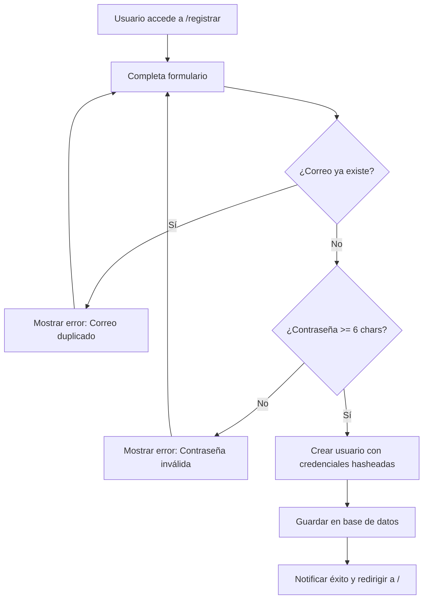
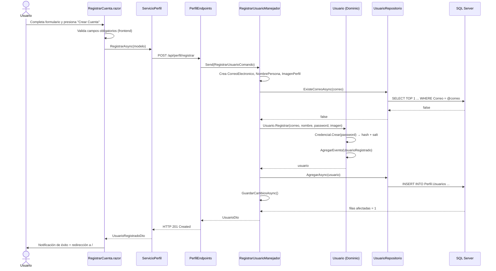

# Caso de Uso: Registrar Cuenta

## 👥 Perspectiva Funcional

### Objetivo
Permitir que una persona nueva cree una cuenta de usuario en FinanKore para acceder a la plataforma de gestión financiera.

### Actor
- **Usuario anónimo**: cualquier persona que aún no posea una cuenta en el sistema.

### Guía de Uso
1. El usuario accede a la página de inicio (`/`) y presiona el botón **Registrarse**.
2. El sistema muestra el formulario de registro en `/registrar`.
3. El usuario completa los siguientes campos obligatorios:
   - **Correo electrónico**: debe contener `@` y tener al menos 5 caracteres.
   - **Nombre completo**: se dividirá automáticamente en nombres y apellidos.
   - **Contraseña**: mínimo 6 caracteres.
   - **URL de imagen** (opcional): foto de perfil personalizada.
4. El usuario presiona **Crear Cuenta**.
5. El sistema valida los datos:
   - Si el correo ya está registrado, muestra un mensaje de error.
   - Si la contraseña tiene menos de 6 caracteres, muestra un mensaje de error.
   - Si los datos son válidos, crea la cuenta y redirige a la página de inicio.
6. El usuario recibe una notificación de éxito: *"¡Bienvenido [Nombre]! Tu cuenta ha sido creada exitosamente."*

### Reglas de Negocio
- El **correo electrónico es único** en todo el sistema. No se permiten duplicados.
- La **contraseña debe tener al menos 6 caracteres**.
- El **nombre no puede estar vacío**.
- Si no se proporciona imagen, el sistema asigna una imagen de perfil predeterminada.
- La cuenta se crea **activa por defecto** (`Activo = true`).
- La fecha de registro se guarda automáticamente en UTC.

### Diagrama de Flujo Funcional



---

## 💻 Perspectiva Técnica

### Mapa de Componentes

| Capa | Proyecto | Archivo | Responsabilidad |
| :--- | :--- | :--- | :--- |
| **Presentación** | `FinanKore.Web` | `Components/Pages/RegistrarCuenta.razor` | Formulario Radzen con validación frontend |
| **Presentación** | `FinanKore.Web` | `Servicios/ServicioPerfil.cs` | Cliente HTTP que envía petición a WebApi |
| **Presentación** | `FinanKore.Web` | `Models/RegistrarCuentaModelo.cs` | Modelo de datos del formulario |
| **API** | `FinanKore.WebApi` | `Endpoints/PerfilEndpoints.cs` | Minimal API que expone `POST /api/perfil/registrar` |
| **Aplicación** | `FinanKore.Application` | `Perfil/Comandos/RegistrarUsuarioComando.cs` | Record MediatR con datos de entrada |
| **Aplicación** | `FinanKore.Application` | `Perfil/Comandos/RegistrarUsuarioManejador.cs` | Handler que orquesta el flujo de registro |
| **Aplicación** | `FinanKore.Application` | `Perfil/Dtos/UsuarioDto.cs` | DTO de respuesta con datos del usuario creado |
| **Dominio** | `FinanKore.Domain` | `Perfil/Usuario.cs` | Entidad raíz agregada. Método estático `Registrar(...)` |
| **Dominio** | `FinanKore.Domain` | `Perfil/ObjetosValor/CorreoElectronico.cs` | Valida formato del correo |
| **Dominio** | `FinanKore.Domain` | `Perfil/ObjetosValor/NombrePersona.cs` | Divide nombre completo en nombres/apellidos |
| **Dominio** | `FinanKore.Domain` | `Perfil/ObjetosValor/Credencial.cs` | Genera hash SHA-256 + salt |
| **Dominio** | `FinanKore.Domain` | `Perfil/ObjetosValor/ImagenPerfil.cs` | Objeto de valor para la foto de perfil |
| **Dominio** | `FinanKore.Domain` | `Perfil/Eventos/UsuarioRegistrado.cs` | Evento de dominio emitido al crear usuario |
| **Dominio** | `FinanKore.Domain` | `Perfil/IUsuarioRepositorio.cs` | Interfaz del repositorio |
| **Infraestructura** | `FinanKore.Infrastructure` | `Persistencia/Repositorios/UsuarioRepositorio.cs` | Implementación EF Core del repositorio |
| **Infraestructura** | `FinanKore.Infrastructure` | `Persistencia/Configuraciones/UsuarioConfiguracion.cs` | Mapeo de entidad a tabla `Perfil.Usuarios` |
| **Infraestructura** | `FinanKore.Infrastructure` | `Persistencia/AppDbContext.cs` | DbContext con Unidad de Trabajo |

### Contrato de Datos

**Entrada:** `RegistrarUsuarioComando`
```csharp
public sealed record RegistrarUsuarioComando(
    string Correo,      // NVARCHAR(200), obligatorio, único
    string Nombre,      // Se parsea a NombrePersona
    string Password,    // Mínimo 6 caracteres
    string? ImagenUrl   // Opcional
) : IRequest<UsuarioDto>;
```

**Salida:** `UsuarioDto`
```csharp
public sealed record UsuarioDto(
    Guid Id,
    string Correo,
    string NombreCompleto,
    string? ImagenUrl,
    DateTimeOffset FechaRegistro
);
```

### Lógica de Dominio

La lógica de negocio principal reside en la **Entidad `Usuario`** (`src/FinanKore.Domain/Perfil/Usuario.cs`):

```csharp
public static Usuario Registrar(
    CorreoElectronico correo,
    NombrePersona nombre,
    string passwordPlano,
    ImagenPerfil? imagen = null)
```

**Invariantes validadas:**
1. `correo` no puede ser nulo.
2. `nombre` no puede ser nulo.
3. `passwordPlano` no puede estar vacío (mínimo 6 chars validado por `Credencial.Crear`).

**Objetos de valor involucrados:**
- `CorreoElectronico`: normaliza a minúsculas y valida formato.
- `NombrePersona`: divide `"Juan Pérez"` en `Nombres="Juan"`, `Apellidos="Pérez"`.
- `Credencial`: genera salt aleatorio de 16 bytes + hash SHA-256.
- `ImagenPerfil`: si es vacío, retorna `Predeterminada`.

**Evento emitido:** `UsuarioRegistrado(UsuarioId, Correo, NombreCompleto, FechaRegistro)`.

### Persistencia

**Tabla:** `Perfil.Usuarios`

| Columna | Tipo | Restricción |
| :--- | :--- | :--- |
| `Id` | `UNIQUEIDENTIFIER` | `PK` |
| `Correo` | `NVARCHAR(200)` | `NOT NULL, UNIQUE` |
| `Nombres` | `NVARCHAR(100)` | `NOT NULL` |
| `Apellidos` | `NVARCHAR(100)` | `NOT NULL` |
| `PasswordHash` | `NVARCHAR(100)` | `NOT NULL` |
| `PasswordSalt` | `NVARCHAR(50)` | `NOT NULL` |
| `ImagenUrl` | `NVARCHAR(500)` | `NULL` |
| `FechaRegistro` | `DATETIMEOFFSET` | `NOT NULL` |
| `FechaUltimoAcceso` | `DATETIMEOFFSET` | `NULL` |
| `Activo` | `BIT` | `NOT NULL, DEFAULT 1` |

### Diagrama de Secuencia


